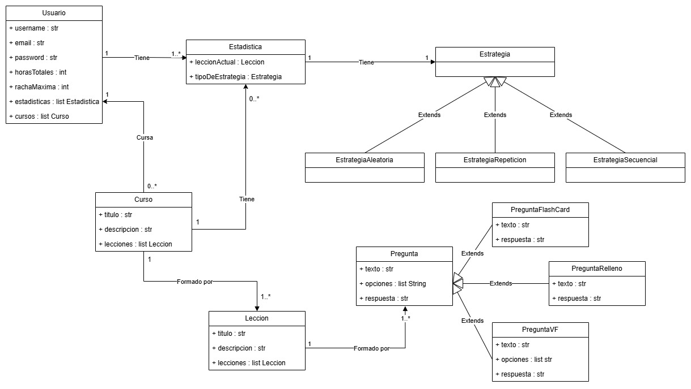

# Identificación de Casos de Uso

La aplicación permitirá a los usuarios aprender programación a través de la realización de cursos con diferentes tipos de ejercicios, estos cursos pueden ser creados por la comunidad o bien cursos nativos de la aplicación. A continuación, se identifican y detallan los principales casos de uso de la aplicación.

## Actores del sistema
**Usuario**: Persona que utiliza la aplicación para realizar cursos o crear nuevos cursos. 
**Sistema**: Actor que inicia procesos para llevar a cabo la funcionalidad de la aplicación.

## Lista de Casos de Uso
| ID   | Nombre del Caso de Uso           | Descripción                                          | Actor Principal |
|------|--------------------------------|---------------------------------------------------|----------------|
| CU01 | Registrarse                   | Permite a un usuario crear una cuenta nueva.       | Usuario       |
| CU02 | Iniciar sesión                | Permite a un usuario autenticarse para acceder a la aplicación | Usuario       |
| CU04 | Realizar Curso               | Permite al usuario realizar un curso seleccionado | Usuario     |
| CU05 | Consultar Estadísticas       | Permite al usuario visualizar sus estadísticas en la aplicación así como de un único curso | Usuario       |
| CU06 | Reanudar Curso              | Permite al usuario continuar con un curso desde el punto en que lo dejó | Usuario       |
| CU07 | Personalizar Perfil              | Permite al usuario cambiar su foto de perfil y nombre | Usuario       |

## Descripción de Casos de Uso

### CU01: Registrarse
**Actor Principal:** Usuario  
**Precondiciones:** El correo electrónico del usuario no debe estar registrado en el sistema  
**Postcondiciones:** El usuario accede a la aplicación  

**Flujo Básico:**

1. El usuario accede a la ventana de registro
2. El usuario introduce su correo electrónico
3. El usuario introduce su contraseña 
4. El usuario gana acceso a la aplicación

**Flujos Alternativos:**
2a. Si el correo ya está registrado, el sistema muestra un mensaje de error.

---

### CU02: Iniciar Sesión
**Actor Principal:** Usuario  
**Precondiciones:** El usuario debe estar registrado.  
**Postcondiciones:** El usuario accede a la aplicación.  

**Flujo Básico:**
1. El usuario introduce su correo electrónico
2. El usuario introduce su contraseña
3. El sistema comprueba que el usuario este registrado
4. El sistema carga la página principal con los datos de aplicación del usuario

**Flujos Alternativos:**

2a. El usuario ha olvidado la contraseña y selecciona la opción para recuperarla
3a. Los datos introducidos son correctos y el sistema lanza un mensaje de error

---

### CU04: Realizar Curso

**Actor Principal:** Usuario
**Precondiciones:** El Usuario debe estar autenticado
**Postcondiciones:** El estado del curso queda guardado

**Flujo Básico:**

1. El Sistema muestra la lista de cursos disponibles públicamente
2. El usuario selecciona un curso
3. El Usuario selecciona una estrategia de aprendizaje*
4. El Sistema presenta una pregunta al usuario
5. [Bucle]El Usuario responde la pregunta
6. [Bucle]El Sistema verifica la respuesta
7. El Usuario sale del curso
8. El Sistema guarda el progreso del curso y actualiza las estadísticas**

**Flujo Alternativo**
4a. El usuario sale del curso antes de realizar la pregunta
5a. El Sistema guarda el progreso hasta la pregunta anterior
6a. El Sistema actualiza las estadísticas del usuario
7a. El sistema regresa a la ventana principal 

*La estrategia de aprendizaje 
**Se registra el progreso automáticamente

### CU05: Consultar estadísticas

**Actor Principal:** Usuario
**Precondiciones:** El Usuario debe estar autenticado
**Postcondiciones:** El usuario obtiene las estadísticas de un curso

**Flujo Básico:**

1. El Usuario pulsa el botón de estadísticas globales en la ventana principal
2. El Sistema recupera las estadísticas 
3. El Sistema abre una ventana donde muestra las estadísticas del usuario en la aplicación

**Flujo Alternativo**

1a. El Usuario pulsa el botón de estadísticas de un curso
2a. El Sistema recupera las estadísticas de ese curso
3a. El Sistema abre una ventana donde muestra las estadísticas de el curso seleccionado. 

### CU06: Reanudar curso

**Actor Principal:** Usuario
**Precondiciones:** El Usuario debe estar autenticado y tener cursos empezados sin finalizar
**Postcondiciones:** El usuario reanuda el curso por donde lo cerró

**Flujo Básico**

1. El Usuario pulsa el botón de reanudar de un curso que tiene empezado
2. El Sistema recupera las estadísticas del curso
3. El Sistema recupera la pregunta por la que el usuario dejó el curso del archivo JSON/YAML
4. El Sistema le muestra la pregunta al usuario

**Flujo Alternativo**
3a. El Sistema no encuentra el archivo JSON/YAML
4a. El Sistema muestra un error pidiendo al usuario que vuelva a importar el archivo

### CU07: Personalizar Perfil

**Actor Principal:** Usuario
**Precondiciones:** El Usuario debe estar autenticado 
**Postcondiciones:** El Usuario Usuario cambia información de su perfil

**Flujo Básico**

1. Accede a la sección de perfil.
2. Modifica su nombre o foto de perfil.
3. Guarda los cambios.

**Flujo Alternativo**
2a. El Usuario trata de cambiar a una foto no permitida
3a. El Sistema muestra un error

## Modelado de dominio

Por último la representación del Modelado de domínio que creemos oportuna en un análisis preliminar de la app es la siguiente:

